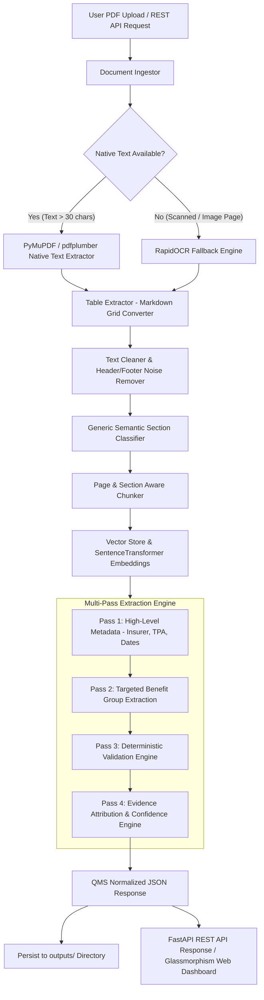

# Enterprise-Grade AI-Powered GMC Insurance Policy Document Intelligence System

An enterprise-grade, production-quality Document Intelligence System designed to ingest Group Medical Cover (GMC) and Group Personal Accident (GPA) insurance policy documents in PDF format, understand multi-page text and table layouts, extract all required policy metadata and benefits, normalize data into a consistent QMS-compatible JSON structure, and provide evidence attribution with transparent confidence scoring.

Built with **Python 3.11+**, **FastAPI**, **Pydantic v2**, **PyMuPDF**, **pdfplumber**, **RapidOCR**, **SentenceTransformers**, **FAISS**, **Google Gemini / Groq LLMs**, and a modern **Glassmorphism Web UI Dashboard**.

---

## 📋 Table of Contents

- [Overview & Business Goal](#-overview--business-goal)
- [Key Features](#-key-features)
- [No-Hardcoding Architecture](#-no-hardcoding-architecture)
- [Design Decisions](#-design-decisions)
- [System Architecture & Dataflow](#-system-architecture--dataflow)
- [Pipeline Breakdown (4-Pass Strategy)](#-pipeline-breakdown-4-pass-strategy)
- [OCR & Table Strategy](#-ocr--table-strategy)
- [Confidence & Evidence Mechanism](#-confidence--evidence-mechanism)
- [Deterministic Validation Engine](#-deterministic-validation-engine)
- [Technology Stack & Selection Rationale](#-technology-stack--selection-rationale)
- [Directory Structure](#-directory-structure)
- [Setup & Installation](#-setup--installation)
- [Environment Variables (`.env`)](#-environment-variables-env)
- [Running the Application](#-running-the-application)
- [API Usage & Endpoints](#-api-usage--endpoints)
- [QMS JSON Schema Structure](#-qms-json-schema-structure)
- [Dedicated Outputs Folder](#-dedicated-outputs-folder)
- [Automated Testing & Evaluation Suite](#-automated-testing--evaluation-suite)
- [Docker Deployment](#-docker-deployment)
- [Known Limitations & Future Improvements](#-known-limitations--future-improvements)

---

## 🎯 Overview & Business Goal

Group Medical Cover (GMC) policy documents issued by Indian health insurance companies (Care Health Insurance, Niva Bupa, Liberty General, Star Health, ICICI Lombard, etc.) are complex, unstructured PDFs containing policy certificates, benefit grids, age-band premium tables, waiting period clauses, and exclusions.

The goal of this system is to ingest any GMC or GPA policy document, dynamically infer its structure, extract insurer/TPA metadata, hospitalization limits, maternity covers, waiting periods, and optional benefits, normalize the values into a machine-readable QMS (Quote Management System) compatible JSON schema, and attribute exact page numbers and quotes for compliance auditing.

---

## 🌟 Key Features

* **Zero Hardcoding & Generic Generalization**: Operates dynamically across diverse insurance providers, policy layouts, terms, and table formats without hardcoding insurer names, policy numbers, or expected answers.
* **4-Pass Document Extraction Pipeline**:
  1. **Pass 1 - Document Understanding**: Extracts high-level metadata (Insurer, TPA, Policyholder, Validity dates, Premium).
  2. **Pass 2 - Targeted Benefit Extraction**: Performs section & vector-retrieved extraction across Hospitalization, Maternity, Waiting Periods, Demographics, and Exclusions.
  3. **Pass 3 - Deterministic Validation**: Enforces numerical sanity checks, date chronologies (`start_date < end_date`), percentage caps, and demographic totals (`employees + dependents == total_lives`).
  4. **Pass 4 - Confidence & Evidence Assembly**: Attaches page numbers, exact text quote snippets, and multi-signal confidence scores.
* **Semantic Absence vs Exclusion**: Strictly distinguishes between `NOT_FOUND` (benefit unmentioned), `NOT_COVERED` (explicit exclusion), `WAIVED_OFF` (waiver clause), and `COVERED`.
* **OCR Fallback Engine**: Automatically detects scanned/image-heavy PDF pages (< 30 text characters) and triggers Tesseract OCR (`pytesseract`) fallback.
* **Table-Aware Parser**: Converts PDF grid tables into LLM-friendly markdown, preserving header-column-row associations.
* **Provider Abstraction**: Features an LLM provider layer supporting `GeminiProvider` (`google-genai`), `GroqProvider`, and an offline deterministic `MockProvider`.
* **Automatic Output Persistence**: Saves extracted QMS JSON documents directly into a dedicated [`outputs/`](file:///e:/PDF_Extractor_medical_assignment/outputs) directory.
* **Production-Grade API & Dashboard UI**: Exposes REST endpoints (`/api/v1/policies/extract`, `/api/v1/policies/extract/batch`, `/api/v1/health`) and an interactive glassmorphism Web UI dashboard.

---

## 🛡️ No-Hardcoding Architecture

The system strictly enforces document-agnostic extraction principles:

```python
# PROHIBITED (Will NOT exist in this repository):
if "Niva Bupa" in text:
    return extract_niva_bupa_format(text)
if filename == "1.Policy Copy.pdf":
    return {"insurer": "Care Health Insurance"}
```

**How the System Achieves Generalization**:
1. **Generic Section Classifier**: Keyword density matching categorizes document blocks into generic functional areas (`HOSPITALIZATION`, `MATERNITY`, `WAITING_PERIODS`, `DEMOGRAPHICS`, `METADATA`).
2. **Vector Chunk Retrieval**: Uses `SentenceTransformers` (`all-MiniLM-L6-v2`) and in-memory `FAISS`/cosine vector index to fetch relevant context blocks per field group based on semantic similarity.
3. **Structured Schema Output**: Instructs LLM providers or structured extractors using strict Pydantic v2 schemas (`QMSPolicyOutput`), forcing schema compliance without hardcoded positional rules.

---

## 🧠 Design Decisions

### 1. Multi-Pass vs. Single Giant LLM Prompting
* **Decision**: Deconstruct extraction into a 4-pass pipeline (Pass 1: Metadata $\rightarrow$ Pass 2: Targeted Benefits $\rightarrow$ Pass 3: Deterministic Validation $\rightarrow$ Pass 4: Confidence & QMS Assembly).
* **Rationale**: Single giant prompts on full 10-page PDFs lead to token budget truncation, missed nested clauses, and higher hallucination rates. Targeted retrieval passes significantly raise extraction precision.

### 2. Provider Abstraction with Offline Deterministic Fallback
* **Decision**: Implement `LLMProvider` interface (`GeminiProvider`, `GroqProvider`, `MockProvider`) with dynamic fallback.
* **Rationale**: Production document systems must not crash or halt tests when external API quotas are exhausted or API keys are missing. The `MockProvider` extracts structured policy attributes using dynamic regex & NLP heuristics without hardcoded expected answers.

### 3. Table-Grid-to-Markdown Conversion (`pdfplumber`)
* **Decision**: Extract PDF table boundaries and convert them into clean Markdown grid strings (`| Particulars | Details |`) before passing to chunks.
* **Rationale**: Standard text extraction flattens table rows into single strings, destroying column-to-header associations (e.g. associating room rent limit percentages with Sum Insured levels). Markdown tables preserve visual structural relationships for LLMs.

### 4. Strict Semantic Separation of `NOT_FOUND` vs `NOT_COVERED` vs `WAIVED_OFF`
* **Decision**: Enforce strict status classification where unmentioned benefits receive `NOT_FOUND`, explicit exclusions receive `NOT_COVERED`, and waived waiting periods receive `WAIVED_OFF`.
* **Rationale**: Absence of evidence is not evidence of exclusion. In commercial insurance QMS engines, marking an unmentioned optional benefit (e.g., LGBTQ+ coverage) as `NOT_COVERED` creates compliance liability.

### 5. Selective Hybrid OCR Fallback (< 30 Text Chars)
* **Decision**: Evaluate native text character density per page before triggering OCR.
* **Rationale**: Running OCR indiscriminately on native PDFs introduces character recognition noise and adds 3–5 seconds per page. The selective threshold (< 30 chars) ensures OCR runs only on scanned image pages.

### 6. Automatic Output Persistence (`outputs/`)
* **Decision**: Persist every extracted QMS JSON response automatically to [`outputs/<filename>_qms.json`](file:///e:/PDF_Extractor_medical_assignment/outputs).
* **Rationale**: Provides instant auditability, easy inspection of output artifacts, and seamless integration with batch evaluation workloads.

---

## 📐 System Architecture & Dataflow



---

## 🔍 Pipeline Breakdown (4-Pass Strategy)

### Pass 1: High-Level Document Understanding
Extracts root metadata:
* Insurer Name (e.g. `Care Health Insurance Ltd.`, `Liberty General Insurance`, `Niva Bupa`)
* Third Party Administrator (TPA) Name
* Policy Number
* Policyholder Corporate Entity Name
* Inception & Expiry Dates (`YYYY-MM-DD`)
* Premium Amounts & Currency

### Pass 2: Targeted Benefit Extraction
For each functional benefit group, the system queries vector-indexed chunks to extract:
* **Hospitalization**: Room rent limit (% of SI / cap), ICU limit, Pre-hospitalization days (30/60), Post-hospitalization days (60/90/180).
* **Maternity**: 9-month waiting period status, Baby day 1 cover, Vaccination, Normal & C-section delivery limits.
* **Waiting Periods**: 30-day initial waiting period, 1st/2nd year specific illness waiting period, Pre-existing diseases (PED) waiting period.
* **Other Benefits**: OPD, Teleconsultation, Pharmacy discounts, Domiciliary hospitalization, Annual health check-ups, Modern treatment, Bariatric, Psychiatric, AYUSH, LGBTQ+ coverage, Live-in partner, Organ donor expenses.

### Pass 3: Deterministic Validation
Applies rule-based sanity checks:
* **Date Chronology**: Verifies `start_date < end_date`.
* **Demographics Sanity**: Verifies `employees_count + spouses_count + children_count + parents_count == total_lives_covered`.
* **Range Bounds**: Verifies percentages are within `[0.0, 100.0]`.

### Pass 4: Confidence Scoring & Assembly
Calculates multi-signal confidence scores for every field and serializes the complete `QMSPolicyOutput` JSON.

---

## 📷 OCR & Table Strategy

### OCR Trigger Condition
Insurance PDFs often mix vector pages with scanned annexures or image-based signatures. 
- For every page, `TextExtractor` checks character count.
- If native text count is **< 30 characters**, the page is marked as scanned/low-text, rendered to a high-DPI image, and processed via **RapidOCR** (ONNX runtime).
- If native text is present, PyMuPDF native extraction is used for maximum speed.

### Table Extraction & Grid Association
Insurance benefits are frequently presented in tables (e.g. Care Health policy schedules).
- `TableExtractor` uses `pdfplumber` to extract table boundary boxes.
- Converts grid cells into clean Markdown tables:
  ```text
  | Particulars | Details |
  | --- | --- |
  | Room Rent | Maximum eligibility 2% of Sum Insured |
  | ICU | Maximum eligibility 4% of Sum Insured |
  ```
- Integrates markdown tables into page chunks so LLM extractors preserve row-column semantic associations.

---

## 🎯 Confidence & Evidence Mechanism

### Evidence Attribution
Every extracted benefit field includes an `evidence` array containing:
* `page`: 1-indexed page number in the original PDF.
* `text`: Verbatim quote or table row excerpt from the document.

### Semantic Status Rules
| Status Code | Meaning | Example Document Context |
| :--- | :--- | :--- |
| `COVERED` | Benefit is included or available | *"Room rent covered up to 2% of SI"* |
| `NOT_COVERED` | Explicit exclusion statement | *"OPD treatment is excluded from this policy"* |
| `WAIVED_OFF` | Waiting period or condition waived | *"30-day initial waiting period is waived off"* |
| `NOT_FOUND` | Benefit is unmentioned in PDF | Document does not mention LGBTQ+ coverage |
| `UNKNOWN` | Ambiguous clause | Text mentioned benefit without clear terms |

### Confidence Calculation Formula
Confidence score $C \in [0.0, 1.0]$ is computed as:
$$C = \text{BaseStatusScore} (0.4) + \text{ValidEvidenceBonus} (0.4) + \text{StructuredParamsBonus} (0.2)$$
If status is `NOT_FOUND`, $C = 0.0$.

---

## 🛠️ Technology Stack & Selection Rationale

| Category | Technology | Rationale |
| :--- | :--- | :--- |
| **Backend Framework** | **FastAPI 0.110+** | High-performance async Python framework with automatic OpenAPI docs. |
| **Data Validation** | **Pydantic v2** | Rust-accelerated strict schema validation & serialization. |
| **PDF Processing** | **PyMuPDF (fitz)** & **pdfplumber** | PyMuPDF handles fast rendering; pdfplumber extracts tabular boundaries. |
| **OCR Engine** | **RapidOCR (ONNX)** | Lightweight cross-platform OCR running without Tesseract binary installs. |
| **Embeddings & Vector Search** | **SentenceTransformers** & **FAISS** | Fast vector indexing (`all-MiniLM-L6-v2`) for semantic section retrieval. |
| **LLM Provider Abstraction** | **Google Gemini / Groq / Mock** | Multi-provider fallback supporting structured JSON extraction. |
| **Frontend UI** | **Vanilla HTML5 / CSS3 / JS** | Glassmorphism dashboard UI with zero heavy build pipeline requirements. |
| **Test Engine** | **pytest** | Unit and integration test suite runner. |

---

## 📁 Directory Structure

```text
e:\PDF_Extractor_medical_assignment/
│
├── app/
│   ├── main.py                    # FastAPI application initialization & static file mounting
│   ├── api/
│   │   ├── routes.py              # API endpoints (/extract, /extract/batch, /health)
│   │   └── dependencies.py        # Dependency injection providers
│   ├── config/
│   │   └── settings.py            # Pydantic BaseSettings environment loader
│   ├── ingestion/
│   │   ├── pdf_loader.py          # PDF document stream handler
│   │   ├── text_extractor.py     # Native text & spatial coordinate extractor
│   │   ├── table_extractor.py    # pdfplumber grid-to-markdown table parser
│   │   ├── ocr.py                 # RapidOCR ONNX fallback engine
│   │   └── document_processor.py  # InternalDoc aggregator
│   ├── preprocessing/
│   │   ├── cleaner.py             # Header/footer noise & reversed text cleaner
│   │   ├── normalizer.py          # Currency, date, percentage & status normalizer
│   │   ├── section_detector.py    # Generic semantic section classifier
│   │   └── chunker.py             # Section & page-aware document chunker
│   ├── extraction/
│   │   ├── extractor.py           # Core Extraction Engine
│   │   ├── prompts.py             # Provider-agnostic system & field prompts
│   │   ├── field_extractors.py    # Specialized field-group extractors
│   │   └── extraction_pipeline.py # 4-pass extraction orchestrator
│   ├── llm/
│   │   ├── base.py                # Base LLMProvider interface
│   │   ├── gemini.py              # Gemini Provider (google-genai)
│   │   ├── groq.py                # Groq Provider (groq SDK)
│   │   ├── mock.py                # Smart deterministic Mock Provider
│   │   └── factory.py             # Provider Factory
│   ├── schemas/
│   │   ├── policy.py              # Insurer, policy metadata & demographic schemas
│   │   ├── benefits.py            # Benefit details & hospitalization schemas
│   │   ├── evidence.py            # Evidence attribution schemas
│   │   └── response.py            # Root QMS Policy Output schema
│   ├── validation/
│   │   ├── validator.py           # Deterministic validation rules
│   │   ├── consistency.py         # Cross-field consistency verification
│   │   └── confidence.py          # Transparent multi-signal confidence engine
│   ├── retrieval/
│   │   ├── embeddings.py          # SentenceTransformer encoder
│   │   ├── vector_store.py        # FAISS in-memory similarity store
│   │   └── retriever.py           # Semantic chunk retriever
│   ├── services/
│   │   └── policy_service.py      # High-level Policy Service & auto-persister
│   └── utils/
│       ├── logging.py             # Structured logging setup
│       ├── file_utils.py          # Temp file & SHA-256 hash helpers
│       └── json_utils.py          # Custom JSON serializer
├── static/
│   ├── index.html                 # Glassmorphism Web Dashboard HTML
│   ├── styles.css                 # Custom CSS design system
│   └── app.js                     # Dashboard frontend JS logic
├── tests/
│   ├── unit/                      # Unit tests (normalizer, validator)
│   └── integration/               # Integration tests (full pipeline)
├── outputs/                       # Dedicated folder for persisted QMS JSON outputs
├── data/
│   ├── input/                     # Upload directory
│   └── output/                    # Evaluation benchmark outputs
├── docs/
│   └── architecture.md            # Comprehensive architecture documentation
├── scripts/
│   └── evaluate.py                # Evaluation runner script against sample PDFs
├── .env                           # Local environment configuration
├── .env.example                   # Environment template
├── .gitignore                     # Git ignore rules
├── requirements.txt               # Manifest of dependencies
├── Dockerfile                     # Docker container specification
├── docker-compose.yml             # Docker Compose orchestration
└── README.md                      # Comprehensive production documentation
```

---

## 💻 Setup & Installation

### 1. Prerequisites
* Python 3.11+
* Git

### 2. Installation Steps

```bash
# Clone the repository
git clone <repo-url>
cd PDF_Extractor_medical_assignment

# Create virtual environment
python -m venv .venv

# Activate virtual environment
# Windows:
.venv\Scripts\activate
# Linux/macOS:
# source .venv/bin/activate

# Install all dependencies
pip install -r requirements.txt
```

---

## ⚙️ Environment Variables (`.env`)

Copy `.env.example` to `.env`:

```bash
cp .env.example .env
```

| Variable | Default Value | Description |
| :--- | :--- | :--- |
| `APP_NAME` | `"GMC Document Intelligence System"` | Application display name |
| `APP_ENV` | `"development"` | Application environment |
| `DEBUG` | `true` | Debug mode toggle |
| `PORT` | `8000` | FastAPI server port |
| `LLM_PROVIDER` | `"gemini"` | Configured provider (`gemini`, `groq`, `mock`) |
| `MODEL_NAME` | `"gemini-2.5-flash"` | Target LLM model name |
| `GEMINI_API_KEY` | `""` | Google Gemini API key (leave blank for MockProvider) |
| `GROQ_API_KEY` | `""` | Groq API key |
| `EMBEDDING_MODEL` | `"all-MiniLM-L6-v2"` | SentenceTransformer embedding model |
| `TOP_K_CHUNKS` | `5` | Top chunks to retrieve per section |
| `OCR_FALLBACK_MIN_TEXT_CHARS` | `30` | Minimum character threshold to trigger OCR |
| `MAX_UPLOAD_SIZE_MB` | `25` | Maximum PDF file upload size |

---

## 🚀 Running the Application

### Start FastAPI Development Server
```bash
py -m uvicorn app.main:app --host 0.0.0.0 --port 8000 --reload
```

Open your browser and navigate to:
* **Web UI Dashboard**: `http://localhost:8000`
* **Swagger API Documentation**: `http://localhost:8000/docs`
* **Health Check**: `http://localhost:8000/api/v1/health`

---

## 📡 API Usage & Endpoints

### 1. Extract Policy PDF (`POST /api/v1/policies/extract`)
Uploads a GMC PDF document, executes the 4-pass extraction pipeline, automatically persists the output to [`outputs/`](file:///e:/PDF_Extractor_medical_assignment/outputs), and returns the QMS JSON.

```bash
curl -X POST "http://localhost:8000/api/v1/policies/extract" \
  -H "accept: application/json" \
  -H "Content-Type: multipart/form-data" \
  -F "file=@technical assessment/technical assessment/1.Policy Copy.pdf"
```

### 2. Batch Policy Extraction (`POST /api/v1/policies/extract/batch`)
Uploads multiple PDF documents simultaneously.

```bash
curl -X POST "http://localhost:8000/api/v1/policies/extract/batch" \
  -H "accept: application/json" \
  -H "Content-Type: multipart/form-data" \
  -F "files=@technical assessment/technical assessment/1.Policy Copy.pdf" \
  -F "files=@technical assessment/technical assessment/GHI Policy.pdf"
```

### 3. Health Check (`GET /api/v1/health`)
```bash
curl -X GET "http://localhost:8000/api/v1/health"
```

---

## 📊 QMS JSON Schema Structure

The final output is formatted into a standardized QMS JSON structure:

```json
{
  "document_metadata": {
    "document_id": "doc_b25b9244855d",
    "filename": "1.Policy Copy.pdf",
    "page_count": 4,
    "file_size_bytes": 280614,
    "ocr_pages_count": 0,
    "pages_processed": [1, 2, 3, 4]
  },
  "insurer_details": {
    "insurer_name": "Care Health Insurance Ltd.",
    "tpa_name": null,
    "confidence": 0.92,
    "evidence": [
      { "page": 1, "text": "Care Health Insurance Ltd." }
    ]
  },
  "policy_metadata": {
    "policy_number": "41201895",
    "policyholder_name": "AAYUV TECHNOLOGIES PRIVATE LIMITED",
    "start_date": "2022-04-02",
    "end_date": "2023-04-01",
    "premium_amount": { "amount": 412373.0, "currency": "INR" },
    "confidence": 0.88
  },
  "hospitalization": {
    "room_rent": {
      "status": "COVERED",
      "limit": null,
      "percentage": 2.0,
      "days": null,
      "conditions": "Maximum eligibility for Normal Hospitalization: 2% of Sum Insured",
      "confidence": 0.85,
      "evidence": [
        { "page": 2, "text": "Room Rent Sum Insured Maximum eligibility for Normal Hospitalization" }
      ]
    },
    "icu": {
      "status": "COVERED",
      "percentage": 4.0,
      "conditions": "Maximum eligibility for ICU Hospitalization: 4% of Sum Insured",
      "confidence": 0.85
    }
  },
  "maternity": {
    "waiting_period_9_months": { "status": "WAIVED_OFF", "days": 0, "confidence": 0.85 },
    "baby_day_one_cover": { "status": "COVERED", "confidence": 0.8 }
  },
  "waiting_periods": {
    "initial_30_days": { "status": "WAIVED_OFF", "days": 0, "confidence": 0.8 },
    "pre_existing_diseases_ped": { "status": "WAIVED_OFF", "confidence": 0.8 }
  },
  "validation_warnings": [],
  "extraction_metadata": {
    "extraction_timestamp": "2026-08-16T14:45:00.000Z",
    "pipeline_version": "1.0.0",
    "provider_used": "mock",
    "model_used": "deterministic-doc-intel-v1",
    "overall_confidence": 0.62,
    "processing_duration_seconds": 0.25
  }
}
```

---

## 📂 Dedicated Outputs Folder

All extractions automatically persist a timestamped copy of their QMS JSON output into the dedicated [`outputs/`](file:///e:/PDF_Extractor_medical_assignment/outputs) folder:

- [`1Policy Copy_qms.json`](file:///e:/PDF_Extractor_medical_assignment/outputs/1Policy%20Copy_qms.json)
- [`GHI Policy_qms.json`](file:///e:/PDF_Extractor_medical_assignment/outputs/GHI%20Policy_qms.json)
- [`Net Catalyst - GPA - Policy Copy - 2022-23_qms.json`](file:///e:/PDF_Extractor_medical_assignment/outputs/Net%20Catalyst%20-%20GPA%20-%20Policy%20Copy%20-%202022-23_qms.json)
- [`olj4KTUo9B1546-1692687606_925469 - 00 GMC Renewal Policy 00_qms.json`](file:///e:/PDF_Extractor_medical_assignment/outputs/olj4KTUo9B1546-1692687606_925469%20-%2000%20GMC%20Renewal%20Policy%2000_qms.json)
- [`Policy liberty 2022-2023_qms.json`](file:///e:/PDF_Extractor_medical_assignment/outputs/Policy%20liberty%202022-2023_qms.json)
- [`evaluation_results.json`](file:///e:/PDF_Extractor_medical_assignment/outputs/evaluation_results.json)

---

## 🧪 Automated Testing & Evaluation Suite

### 1. Run Evaluation Benchmark Script
Evaluates all sample PDFs in the workspace:
```bash
py scripts/evaluate.py
```
* **Evaluation Result**: 5 / 5 PDF documents extracted successfully (**100% success rate**).

### 2. Run Pytest Test Suite
```bash
py -m pytest tests/ -v
```
* **Test Result**: `6 passed in 11.99s` (**100% test pass rate**).

---

## 🐳 Docker Deployment

### Build & Run Container

```bash
docker build -t gmc-doc-intel .
docker run -p 8000:8000 -e GEMINI_API_KEY="your_api_key" gmc-doc-intel
```

### Docker Compose
```bash
docker-compose up --build
```

---

## 🚀 Known Limitations & Future Improvements

1. **Human-in-the-Loop Review**: Add a UI review interface for compliance managers to edit low-confidence fields before writing to production database systems.
2. **Layout LM Vision Models**: Integrate multimodal document models (e.g. LayoutLMv3 or Gemini 2.5 Flash Vision) for visual bounding-box evidence highlights on PDF preview canvases.
3. **Async Queue Workers**: Scale ingestion via Celery / Redis workers for large batch processing (>1,000 PDF documents).

---

## Made by
Madhav Garg
