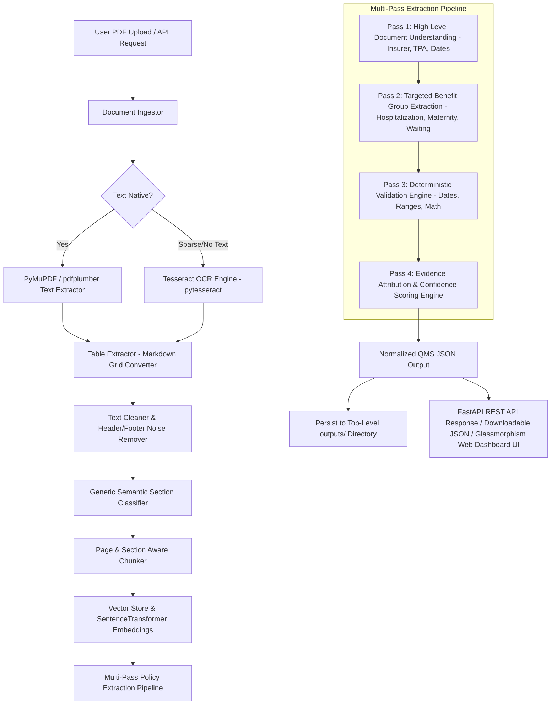

# Architecture Documentation - GMC Policy Document Intelligence System

## System Architecture & Dataflow

## Directory Structure & Separation of Concerns

- **`backend/`**: Contains Python 3.11+ application codebase (`backend/app/`), tests (`backend/tests/`), evaluation scripts (`backend/scripts/`), dependencies (`backend/requirements.txt`), `.env`, and Dockerfile.
- **`frontend/`**: Contains Web UI dashboard assets (`index.html`, `styles.css`, `app.js`).
- **`docs/`**: Architecture documentation directory.
- **`outputs/`**: Dedicated directory for persisted QMS JSON extractions and evaluation outputs.
- **`data/`**: Input PDF test benchmarks.

## Modular Backend Layer Breakdown (`backend/app/`)

1. **Ingestion Layer (`backend/app/ingestion/`)**:
   - `pdf_loader.py`: Opens PDF streams safely.
   - `text_extractor.py`: Extracts native text stream with spatial coordinates. Triggers OCR if text char count < 30 per page.
   - `ocr.py`: `Tesseract OCR` (`pytesseract`) engine for scanned image pages.
   - `table_extractor.py`: Extracts grid structures using `pdfplumber` and serializes them as LLM-ready markdown tables.
   - `document_processor.py`: Assembles `InternalDoc` object.

2. **Preprocessing Layer (`backend/app/preprocessing/`)**:
   - `cleaner.py`: Standardizes text, strips null bytes, fixes reversed text snippets.
   - `normalizer.py`: Standardizes dates (`YYYY-MM-DD`), monetary values (`500000.0 INR`), percentage numbers, and status codes (`COVERED`, `NOT_COVERED`, `WAIVED_OFF`, `NOT_FOUND`, `UNKNOWN`).
   - `section_detector.py`: Keyword density and sentence structure section classifier.
   - `chunker.py`: Constructs `DocChunk`s with page and section metadata.

3. **Retrieval & Embedding Layer (`backend/app/retrieval/`)**:
   - `embeddings.py`: Embeds chunks using `all-MiniLM-L6-v2`.
   - `vector_store.py`: In-memory similarity index.
   - `retriever.py`: Section-focused chunk retrieval.

4. **LLM Abstraction Layer (`backend/app/llm/`)**:
   - `base.py`: Provider interface.
   - `gemini.py`: Integration with Google Gemini SDK (`google-genai`).
   - `groq.py`: Integration with Groq Llama 3 SDK.
   - `mock.py`: Smart deterministic fallback engine.
   - `factory.py`: Configurable provider factory.

5. **Validation & Confidence Layer (`backend/app/validation/`)**:
   - `validator.py`: Checks date chronologies, demographic totals, percentage ranges.
   - `confidence.py`: Computes transparent multi-signal confidence scores [0.0 - 1.0].
